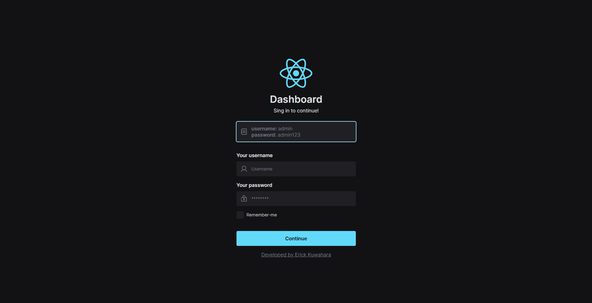

    <h2>⚜️ D A S H B O A R D ⚜️</h2>

    <a href="#-project">Project</a>&nbsp;&nbsp;&nbsp;|&nbsp;&nbsp;&nbsp;
    <a href="#-technologies">Technologies</a>&nbsp;&nbsp;&nbsp;|&nbsp;&nbsp;&nbsp;
    <a href="#-features">Features</a>

 

<h3 align="center">
    
     
    <a href="https://erickks.github.io/dashboard-react/">live demo</a>
</h3>

 

## 📚 Project

I decided to develop this dashboard because it would be great for me to practice developing with react and typescript. I created the dashboard design, took inspiration from some examples, and adapted them.

I confess that it took a bit of work to develop this dashboard, but with determination, I did it!

 

## 🖥 Technologies

- [React](https://reactjs.org/)
- [TypeScript](https://www.typescriptlang.org/)
- [React Router](https://reactrouter.com/en/main)
- [Radix ui](https://www.radix-ui.com/)
- [Chart JS](https://www.chartjs.org/)
- [Tailwindcss](https://tailwindcss.com/)
- [Clsx](https://www.npmjs.com/package/clsx)
- [Phosphor Icons](https://phosphoricons.com/)

 

## 🧾 Features

- [x] Input validation
- [x] Responsive
